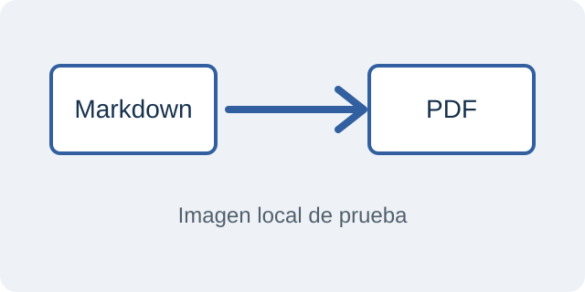

# Documento De Referencia Markdown

Este archivo sirve como banco de pruebas para comprobar que la app interpreta y
convierte correctamente los elementos habituales de Markdown al generar un PDF.
Debe poder abrirse desde la app, generar un PDF y mostrar diferencias claras
cuando alguna parte del flujo no esté soportada todavía.

[TOC]

Metadatos esperados desde YAML:

- Título: Documento De Referencia Markdown.
- Subtítulo: Banco de pruebas para Markdown PDF Designer.
- Autor: Equipo Markdown PDF Designer.
- Fecha: 2026-08-12.
- Idioma: español.

La app debe decidir si estos metadatos solo viajan como información interna o si
las plantillas los muestran en una portada, cabecera o bloque inicial.

---

## 1. Párrafos Y Saltos

Este es un párrafo normal. Incluye texto suficiente para comprobar el ancho de
línea, el interlineado, la separación entre párrafos y la justificación aplicada
por cada plantilla visual.

Este es otro párrafo. Markdown separa párrafos con una línea en blanco.

Esta línea termina con dos espacios para forzar un salto de línea.  
Esta línea debería aparecer justo debajo, dentro del mismo bloque de texto.

## 2. Títulos

# Título Nivel 1

## Título Nivel 2

### Título Nivel 3

#### Título Nivel 4

##### Título Nivel 5

###### Título Nivel 6

## 3. Énfasis En Línea

Texto con **negrita**, *cursiva*, ***negrita y cursiva***, ~~tachado~~,
`código inline`, texto con <sub>subíndice</sub> y texto con <sup>superíndice</sup>.

También conviene probar caracteres frecuentes en español: á, é, í, ó, ú, ñ,
ü, signos de apertura ¿? y ¡!, comillas “tipográficas” y guiones largos.

## 4. Enlaces

Enlace con texto descriptivo: [Pandoc](https://pandoc.org).

Enlace automático: <https://typst.app>.

Correo automático: <contacto@example.com>.

Referencia reutilizable: consulta la [documentación de Markdown][markdown-docs].

[markdown-docs]: https://www.markdownguide.org/basic-syntax/

## 5. Listas No Ordenadas

- Elemento principal.
- Elemento con texto largo para revisar sangrías y saltos de línea dentro de la
  misma viñeta cuando el contenido ocupa más de una línea.
  - Subnivel uno.
    - Subnivel dos.
      - Subnivel tres.
- Último elemento de la lista.

## 6. Listas Ordenadas

1. Primer paso.
2. Segundo paso.
   1. Subpaso A.
   2. Subpaso B.
3. Tercer paso con un párrafo asociado.

   Este párrafo pertenece al tercer paso y debe conservar la sangría visual.

## 7. Listas De Tareas

- [x] Abrir un archivo Markdown.
- [x] Ajustar una plantilla visual.
- [ ] Generar soporte completo para imágenes.
- [ ] Revisar notas al pie y enlaces internos.

## 8. Citas

> Una cita simple debe diferenciarse visualmente del texto normal.

> Una cita puede tener varios párrafos.
>
> El segundo párrafo sigue perteneciendo al mismo bloque citado.

> Cita de primer nivel.
>
> > Cita anidada de segundo nivel.

## 9. Bloques De Código

Código inline largo dentro de una frase:
`ruta/muy/larga/de/ejemplo/para/comprobar/si/el_codigo_inline_parte_linea_correctamente_o_se_sale_del_margen`.

Código sin lenguaje:

```
linea_uno = "valor"
linea_dos = linea_uno.upper()
```

Código Python:

```python
def generar_titulo(texto: str) -> str:
  return texto.strip().title()

print(generar_titulo('markdown pdf designer'))
```

Código JSON:

```json
{
  "documento": "referencia",
  "formatos": ["markdown", "typst", "pdf"],
  "activo": true
}
```

## 10. Tablas Básicas

| Elemento | Estado | Prioridad |
| --- | --- | --- |
| Títulos | Soportado | Alta |
| Listas | Soportado | Alta |
| Imágenes | Pendiente de revisión | Media |
| Notas al pie | Pendiente de revisión | Media |

## 11. Tablas Con Alineación

| Izquierda | Centro | Derecha |
| :--- | :---: | ---: |
| Texto | Texto | 12 |
| Más texto | Valor centrado | 345 |
| Celda larga para probar ajuste de línea | Otro valor | 6789 |

## 12. Tabla Compleja

+----------------------+----------------------+----------------------+
| Columna A            | Columna B            | Columna C            |
+======================+======================+======================+
| Contenido largo que  | Lista dentro de una  | Código inline:       |
| debería partir línea | celda:               | `valor = 42`         |
| sin romper la tabla. |                      |                      |
|                      | - uno                |                      |
|                      | - dos                |                      |
+----------------------+----------------------+----------------------+
| Segunda fila         | Texto normal         | Resultado esperado   |
+----------------------+----------------------+----------------------+

## 13. Tabla Muy Ancha

| Columna con nombre largo A | Columna con nombre largo B | Columna con nombre largo C | Columna con nombre largo D | Columna con nombre largo E |
| --- | --- | --- | --- | --- |
| Texto largo para comprobar si la tabla respeta márgenes | Valor medio | Valor medio | Valor medio | Valor final |
| Otra fila con contenido extenso y poco espacio horizontal | 123456789 | 987654321 | abcdefghijk | cierre |

## 14. Escapes Dentro De Tablas

| Caso | Markdown | Resultado esperado |
| --- | --- | --- |
| Barra vertical escapada | `A \| B` | Debe verse como una barra vertical dentro de la celda |
| Código con barra | `valor \| alternativo` | No debe romper columnas |
| Asterisco escapado | `\*texto\*` | No debe convertirse en cursiva |

## 15. Imágenes

Imagen local con ruta relativa desde este archivo:



La app debería resolver la ruta relativa respecto a la carpeta del Markdown, no
respecto al directorio desde el que se ejecuta la aplicación.

Imagen con título o caption largo:


Imagen dentro de una lista:

- Paso con imagen asociada:

  

Imagen dentro de una cita:

> 
>
> La app debe mostrar si este caso resulta visualmente aceptable.

## 16. Notas Al Pie

Este párrafo incluye una nota al pie breve.[^nota-breve]

También incluye una nota con más contenido.[^nota-larga]

[^nota-breve]: Esta es una nota al pie sencilla.

[^nota-larga]: Esta nota al pie tiene más texto para comprobar el ancho, el salto
  de línea y la separación respecto al cuerpo principal del documento.

## 17. Definiciones

Markdown
: Lenguaje de marcado ligero pensado para escribir texto estructurado de forma
  legible.

PDF
: Formato final de salida que debe conservar composición, tipografía y
  paginación.

Typst
: Motor de maquetación usado para convertir el contenido intermedio en PDF.

## 18. Separadores

Texto antes del separador.

---

Texto después del separador.

## 19. Matemáticas

Fórmula inline: $E = mc^2$.

Fórmula en bloque:

$$
\int_0^1 x^2\,dx = \frac{1}{3}
$$

## 20. HTML Inline Y Bloques HTML

Markdown admite HTML en muchos procesadores. La app debe decidir si lo soporta,
si lo ignora o si muestra una advertencia clara.

Texto con <mark>resaltado HTML</mark> y un salto manual <br> dentro de la línea.

<div>
  <strong>Bloque HTML:</strong> contenido que puede no tener equivalencia directa
  en Typst.
</div>

## 21. Comentarios

El siguiente comentario HTML no debería verse en el PDF final si el conversor lo
trata como comentario.

<!-- Comentario interno que no debería renderizarse. -->

Comentario usado como salto de página:

<!-- pagebreak -->

El texto posterior debería comenzar en una página nueva.

## 22. Bloques Especiales Tipo Alerta

> [!NOTE]
> Este patrón se usa en GitHub para notas destacadas.

> [!WARNING]
> Este patrón no es Markdown básico. La app debe decidir si lo transforma, lo
> deja como cita normal o lo documenta como no soportado.

> [!TIP]
> Un consejo debería diferenciarse de una advertencia si se decide aplicar estilo
> específico a cada tipo de alerta.

> [!IMPORTANT]
> Una alerta importante suele necesitar mayor peso visual.

> [!CAUTION]
> Una precaución debería quedar claramente distinguida del contenido normal.

## 23. Enlaces Internos {#enlaces-internos-personalizados}

Este enlace apunta a la sección [Tablas Básicas](#tablas-básicas).

Este enlace apunta a una sección con identificador personalizado:
[Enlaces internos personalizados](#enlaces-internos-personalizados).

## 24. Enlaces A Archivos Locales

Enlace a otro Markdown del proyecto: [prueba_apuntes.md](prueba_apuntes.md).

Enlace a una imagen local: [imagen-ejemplo.svg](imagenes/imagen-ejemplo.svg).

La app debe decidir si los enlaces a archivos locales se conservan como enlaces,
si se transforman a rutas absolutas o si se muestran como texto normal.

## 25. Caracteres Y Escapes

Caracteres escapados: \*no cursiva\*, \`no código\`, \[no enlace\].

Símbolos frecuentes: %, €, $, &, #, _, *, |, \, /, @.

Unicode técnico: →, ←, ↔, ⇒, ≤, ≥, ≠, ±, ×, ÷, √, ∑, ∆, Ω, µ, ✓, ✗.

## 26. Listas Mixtas Complejas

1. Paso principal con explicación.

   - Sublista no ordenada.
   - Otro elemento con `código inline`.

2. Paso con cita interna.

   > Esta cita está dentro de una lista ordenada.

3. Paso con bloque de código.

   ```text
   codigo_dentro_de_lista = true
   ```

4. Paso con tabla interna.

   | Campo | Valor |
   | --- | --- |
   | contexto | lista |
   | estado | prueba |

## 27. Texto Preformateado Por Sangría

    Este bloque usa cuatro espacios iniciales.
    Debe tratarse como código o texto preformateado.

## 28. Párrafo Final

Si este documento genera un PDF sin errores, la app tiene una base sólida para
Markdown común. Las secciones que no se rendericen bien deben convertirse en
tareas concretas del proyecto.
