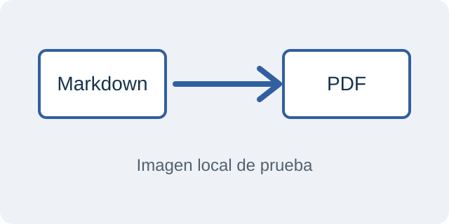

# Imagenes con tamano personalizado

Este documento permite comparar los tamanos de la misma imagen al generar
el PDF. La ruta se resuelve desde la carpeta de este Markdown.

## Ancho relativo: 100 por ciento

Ocupa todo el ancho disponible para el contenido, sin incluir los margenes.
En plantillas de varias columnas, ocupa el ancho de la columna.

{width=100%}

## Ancho relativo: 50 por ciento

Ocupa la mitad del ancho disponible y conserva su proporcion original.

{width=50%}

## Ancho fijo: 5 centimetros

La altura se ajusta automaticamente para conservar la proporcion.

{width=5cm}

## Altura fija: 2 centimetros

El ancho se ajusta automaticamente para conservar la proporcion.

{height=2cm}

## Ancho y altura: 5 por 2 centimetros

La imagen se encaja en el espacio indicado. Si su proporcion original es
distinta, el encaje puede recortar sus bordes. Para mostrarla entera y mantener
su proporcion, es preferible indicar una sola dimension.

{width=5cm height=2cm}

## Imagen dentro de una lista

- Una imagen tambien puede tener tamano dentro de un elemento de lista:

  {width=50%}

- El porcentaje se calcula respecto al espacio disponible en ese elemento.

## Imagen sin pie: centrada por defecto

El texto alternativo vacio permite comprobar el centrado sin pie de figura.

{width=50%}

## Alineacion izquierda

{width=50% align=left}

## Alineacion central explicita

{width=50% align=center}

## Alineacion derecha

{width=50% align=right}

## Imagen alineada dentro de una cita

> Una imagen aislada se alinea dentro del espacio disponible en la cita.
>
> {width=50% align=right}

## Imagen dentro de una frase

Esta imagen {width=2cm} permanece dentro del
texto, sin convertir la frase en un bloque centrado.
